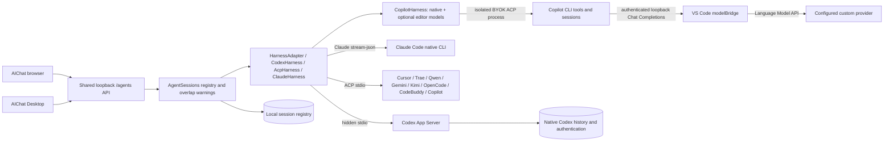

# AIChat agent sessions

`src/core/agentSessions.ts` owns sessions; `codexHarness.ts` implements the stdio
Codex adapter; `acpHarness.ts` adapts native ACP servers; `claudeHarness.ts` adapts Claude bidirectional stream-json. `src/mcp/agentHttp.ts` exposes the API on the shared daemon.
Native CLI sessions have no KP Local Helper or editor-window dependency. Optional
Copilot custom-model sessions require the VS Code model bridge described below.

### Optional Copilot VS Code models

`copilotHarness.ts` merges native models with non-`copilot` providers discovered
through `vscodeModels.ts`. The extension's `modelBridge.ts` starts a separate
authenticated loopback server and registers `~/.keepwork-mcp/model-bridge.json`.
Only model metadata crosses discovery; provider credentials stay in VS Code.
The most recently registered editor window supplies the models. Reconnect refreshes
discovery; closing VS Code leaves native CLI models usable. No browser CORS or
unauthenticated model endpoint is exposed, and its token cannot run terminal commands.

Selected editor models use distinct `vscode:<base64url-id>` IDs. One isolated ACP
process per selected custom model receives a private BYOK environment pointing to
the bridge. The custom process uses Copilot offline mode to prevent GitHub model
fallback; VS Code still connects to the selected provider normally. Normal Copilot
runs keep their native environment and model catalog.
Session-to-model routes are persisted locally without credentials; permission IDs
and process exits are scoped so separate processes cannot answer or interrupt one
another's sessions. Switching provider or custom model requires a new conversation.

The model bridge converts text, function definitions/calls/results and streaming
responses to the stable VS Code Language Model API. It never executes tools: Copilot
does. System/developer content becomes explicitly labelled user instructions because
the stable API has no system role. Images and provider-specific effort controls are
not supported. Disconnect cancels inference and never triggers prompt replay or
subscription fallback. First use may require the editor's model-access consent.

The CLI help must advertise BYOK environment and offline-mode support. Copilot 0.0.403 installed on
the validation machine lacks this support, so custom models produce an upgrade
notice instead of becoming selectable. Real custom inference is not yet verified.
The ordinary CLI path remains usable. No user CLI or extension installation was changed.

Source validation: `npm run check:shared`, `npm run typecheck --prefix apps/vscode-extension`,
`node --test scripts/copilot-model-bridge.test.cjs apps/vscode-extension/scripts/model-bridge.test.cjs`,
and the existing agent-session/backend/discovery tests. Fixtures cover discovery,
private routing, SSE/tool round trips, consent/provider failures, interruption,
editor restart and offline history. AIChat's `tests/e2e/harness_backends.test.mjs`
checks browser selection and routing IDs with isolated model fixtures.

`/health` advertises `agentSessionApi: "v1"`. All `/agents/*` requests require an
explicit allowed Origin and a random `X-Agent-Owner` capability (32–128 ASCII
letters/digits/hyphens), kept locally by AIChat per account. The registry hashes it
with the Origin. Existing optional bearer authentication applies. Never log these
headers or include them in conversation exports.

| Endpoint | Request / result |
| --- | --- |
| `GET /agents/backends?probe=executable` | Read-only installation inventory; no native processes started |
| `GET /agents/backends` | Availability, authentication and model capabilities |
| `GET /agents/backends?backend=codex` | Only the selected provider; does not start or await other CLIs |
| `POST /agents/login` | Codex-managed browser login; returns authorization URL |
| `GET /agents/sessions?cursor=0` | Up to 100 owner session summaries and `nextCursor` |
| `POST /agents/sessions` | `{backend?: registered backend ID, conversationId, roots, rootNames?, model?}`; idempotent per owner/backend/conversation |
| `GET /agents/sessions/:id` | Resume/read and return normalized snapshot |
| `PATCH /agents/sessions/:id` | `{title?, archived?, remove?}`; removal archives |
| `POST /agents/sessions/:id/turns` | `{requestId, text, model?, effort?}`; duplicate IDs do not execute twice; accepted new turns may return advisory `warnings` |
| `POST /agents/sessions/:id/interrupt` | Interrupt current turn |
| `POST /agents/sessions/:id/respond` | `{id, decision}` or `{id, answers: {questionId: text}}` |
| `GET /agents/sessions/:id/events?cursor=` | NDJSON snapshots; initial snapshot always reconciles state |

Snapshots carry status, thread/turn/item IDs, the last submission ID/state, bounded visible items and pending
requests. Disconnects remove listeners without interrupting execution. No arbitrary
RPC forwarding or browser-supplied executable commands are accepted.

The picker uses targeted backend queries. The unfiltered endpoint remains an
explicit all-provider diagnostic and can wait for a slow provider's handshake.
For ACP model discovery, targeted queries accept `cwd` and `conversationId` before
the first prompt, or an owned `sessionId` afterwards, plus optional `model`.
The adapter creates a bounded metadata-only native session with no prompt/tool
execution. It reuses that session on creation for the same owner/conversation/root;
this does not bind the browser draft's workspace. Before any local root is selected,
a daemon-owned empty `model-discovery` directory supplies the metadata session cwd.
Model discovery failure is
reported as `modelsError`, independently of executable/handshake availability.

Each daemon owns one persistent ACP/Codex CLI process per backend. Status requests
reuse successful account and model capabilities rather than rerunning discovery.
ACP draft model/effort catalogues are bounded, shared by native cwd/model, and
coalesce concurrent requests across new drafts. Only metadata is shared: actual
native conversation sessions retain independent owner and history state. A new
conversation still needs its own native session, not another CLI process.
Cached metadata is invalidated on process exit, provider account/model events or
explicit `refresh=1`. Refresh does not close the CLI or interrupt owned sessions.
Failures are not retained as successful capability caches. Opening the picker is
a cache read; pressing Reconnect explicitly revalidates. The daemon disappearing
or restarting requires a genuine cold launch again.

Native WorkBuddy verification (`out/agent-cli-verify/workbuddy-models.json`) found
17 models, with Hy4 preview as default and `high` / `enabled` thought options.
One initialize took 4.8 s, native session discovery 0.4 s; subsequent same-draft
and new-draft catalogue reads took 2 ms while retaining the same PID. These are
local observations, not a claim that the third-party cold launch is instantaneous.

ACP `configOptions` model and `thought_level` selectors (including grouped options)
are normalized to model IDs, native display names, `supportedReasoningEfforts` and
`defaultReasoningEffort`. Selecting a model refreshes native configuration because
effort options can depend on that model. Turns set the model first, then use the
native effort config ID via `session/set_config_option`. Full response/notification
configuration is retained. Active or archived sessions are not reconfigured by a
status query. Legacy `models.availableModels` remains supported. No effort values
are invented when a CLI/model does not advertise a selector; the browser disables
it. See [ACP configuration](https://agentclientprotocol.com/protocol/v1/session-config-options).

NDJSON uses bounded backpressure handling. `ServerResponse.write(false)` means
the frame was accepted into Node's buffer: pause writes until `drain`, coalesce
new full snapshots into one latest pending frame, and suspend heartbeat writes
while blocked. A reader that does not drain for 30 seconds is disconnected; close
removes its subscription and timers without stopping its Codex turn. The browser
reconciles with a normal session GET on stream failure/EOF or a 45-second silence,
then reconnects, so older runtime stream failures do not require clicking Stop.

All three adapters share automatic CLI discovery (see below). `KEEPWORK_CODEX_PATH`
can explicitly select a native executable or JavaScript entry. Processes are hidden and shell-free.
Existing Codex configuration supplies authentication and managed requirements.
AIChat supplies `mode: craft|ask|plan` at creation and on every turn; omitted mode
retains the session choice (legacy sessions default to Craft). `/health` advertises
`agentModeApi: "v1"`. Craft requests Full Access with `approvalPolicy: "never"`
and automatically accepts normalized permission requests. Ask uses read-only
Codex sandbox plus `on-request`, and keeps native approvals interactive for all
providers. Plan uses read-only/never, permits classified read/search requests,
and rejects mutations and execution-plan approvals. Questions stay interactive.
The internal `thread/mode/set` adapter operation negotiates Codex collaboration
presets, Claude `set_permission_mode`, or ACP `session/set_mode` / mode config
options before submitting a prompt. Native errors never replay a prompt or bypass
policy. Missing native planning uses AIChat planning instructions; background
workspace writes are blocked in Plan. Returning to Craft resets native planning.
Mode is persisted and used for resume. App Server still validates managed restrictions.
Selected roots define working directory/reference mapping under Full Access.
Installation and updates remain user-controlled. Protocol sources:
[Codex App Server](https://learn.chatgpt.com/docs/app-server),
[ACP session modes](https://agentclientprotocol.com/protocol/v1/session-modes),
[Claude permissions](https://code.claude.com/docs/en/agent-sdk/permissions).
Offline mode coverage: `node --test scripts/agent-modes.test.cjs`.

Transient provider retry errors clear when item output resumes; pending requests
keep their waiting state even during retry. Raw command results and exit codes
remain available to the UI for inspection.

Workspace context contains roots and resolved file references, with no injected
encoding instructions, including resumed turns. Keepwork's own PowerShell terminals
initialize UTF-8 console/pipeline I/O and default `Get-Content`/`Select-String` reads
to UTF-8 at runtime. Explicit encoding arguments still win; write defaults and user
profiles are unchanged. The cmd spawn fallback retains cmd syntax and selects code
page 65001; stdout/stderr decoding preserves characters split across pipe chunks.
These defaults do not propagate into a separately launched PowerShell process.

Native agent CLI tools own their shell processes; Keepwork does not intercept them
or claim to repair their file decoding. Provider JSON streams already use incremental
UTF-8 decoding, and historical mojibake is passed through unchanged. Regression:
`agent-sessions.test.cjs` (prompt and provider transport), `terminal-encoding.test.cjs`
(real PowerShell reads/pipeline, cmd and split output). `agent-codex-smoke.cjs` remains
an explicit real-provider Unicode acceptance check.

`~/.keepwork-mcp/agent-sessions-v1.json` stores ownership hashes, IDs, roots, metadata
and bounded request-ID history with atomic writes. Transcripts remain with Codex;
live snapshots are bounded in memory. Recovery never reruns prompts. Ambiguous
acceptance keeps that session busy until reconciled. Different sessions may run
concurrently on overlapping canonical paths or the same Git worktree. An accepted
new turn returns `warnings: [{code: "workspace_overlap", sessions: [{id, title}]}]`
when another session is active there; identities are limited to the requesting
owner (at most ten), and other owners produce a generic warning with no identities.
AIChat displays the warning for five seconds without blocking. Warnings are not
saved or replayed; one active turn per session and provider permission policy remain.
Local file tags resolve
against the saved primary/root-name mapping and reject missing files, global aliases
and escapes outside selected roots. Interrupted removal waits for provider completion
before archiving; an unconfirmed stop leaves that session present and busy.

Run `npm run check:shared` and `node --test scripts/agent-sessions.test.cjs`.
The opt-in `node scripts/agent-codex-smoke.cjs` executes one real authenticated turn
in two temporary repositories and archives the resulting thread. AIChat owns browser
and optional desktop integration tests. With Live Server and `TEST_BASE_URL` set,
`AICHAT_REAL_UI_SMOKE=1` also reconnects the real session through both UIs using an
isolated test HTTP service. It does not replace the production daemon.

## Additional CLI adapters and verification

Supported IDs are defined in `src/core/agentCliBackends.ts`: `codex`, `workbuddy`,
`copilot`, `claude`, `cursor`, `trae`, `qwen`, `gemini`, `kimi`, `codebuddy`, `opencode`. Omitted backend defaults to Codex,
including old registry rows. A session keeps its backend fixed. Native thread IDs,
notifications, requests and process exits are scoped to that backend; overlap
warnings still span all backends. No executable, arguments or RPC are accepted
from the browser.

WorkBuddy uses the CodeBuddy CLI ACP engine (`codebuddy --acp`), as documented by
[Tencent](https://www.codebuddy.cn/docs/cli/acp), not desktop UI automation.
Configure `KEEPWORK_WORKBUDDY_PATH` for a compatible native/JS entry. Copilot uses
`copilot --acp --stdio --no-auto-update` following
[GitHub's ACP reference](https://docs.github.com/en/copilot/reference/copilot-cli-reference/acp-server);
configure `KEEPWORK_COPILOT_PATH` when necessary. npm Windows shims resolve to
package JS entries, keeping shell syntax out of the execution path.

ACP availability confirms protocol version 1. It does not prove authentication:
`authenticated: null` / `authState: unknown` remain until the real provider executes.
`POST /agents/login` with any backend except Codex returns a terminal command and
message; only Codex returns a browser authorization URL. Native login/config stay
user owned. ACP tool permission requests are normalized and automatically accepted under Full access;
unknown delegated client methods fail explicitly. Client file/terminal capabilities
are not advertised. Per-turn effort is unsupported. Model options are learned from
native sessions. Codex retains its existing Full Access policy; ACP uses native
permissions and does not automatically approve requests.

The ACP adapters cache bounded normalized transcripts locally under
`agent-sessions-v1.json.<backend>/` (0600 files), separate from the
ownership registry. Native sessions are never deleted. Archive and title are host
metadata. Resume requires advertised `loadSession`; missing support is an explicit
error rather than a fresh session or prompt replay.

The packaged MCP resource `keepwork://skills/agent-cli-verify/SKILL.md` and the
VS Code chat skill expose the repeatable acceptance workflow. Run
`node --test scripts/agent-sessions.test.cjs scripts/agent-backends.test.cjs` for
fixtures and `node scripts/agent-cli-smoke.cjs` for real source-runtime acceptance.
The latter starts an isolated loopback server and calls the same HTTP endpoints.
The packaged skill's `scripts/verify.cjs --url http://127.0.0.1:8089` tests an
installed daemon. Reports under `out/agent-cli-verify/` distinguish passed, failed,
unavailable and not_tested; missing backends never count as passed. A probe-only
or targeted run cannot establish all-provider acceptance.

## Automatic CLI discovery

`src/core/agentCliProcess.ts` resolves all registered backends without executing shell
profiles or installer scripts. Explicit `KEEPWORK_CODEX_PATH`,
`KEEPWORK_WORKBUDDY_PATH`, `KEEPWORK_COPILOT_PATH` settings take priority. An invalid
explicit path fails clearly instead of silently selecting another installation.
Then Keepwork searches PATH, common CLI/package locations and desktop bundles.
Paths with spaces are passed as arguments, never concatenated into a shell command.

- Windows: user npm prefix, `.local/bin`, Scoop shims, WinGet Links,
  `%LOCALAPPDATA%/codebuddy/bin`, configured npm prefix, and known desktop locations
  under Program Files, LocalAppData and LocalAppData/Programs. Codex versioned
  desktop binaries use the newest file. npm `.cmd` launchers resolve to Node entries,
  including extensionless `bin/codebuddy` files.
  Cursor also uses `%LOCALAPPDATA%/cursor-agent`. Trae's official locations are
  `%LOCALAPPDATA%/Programs/TraeCLI/bin` (or `TraeX/bin`), the legacy
  `%LOCALAPPDATA%/trae-cli/bin`, and `TRAECLI_INSTALL_DIR`. Its `traex.exe` alias
  and simple sibling-EXE `.cmd` wrapper are resolved without a shell.
- macOS: `.local/bin`, npm prefixes, Volta, NVM Node versions, `/opt/homebrew/bin`,
  `/usr/local/bin`, `/usr/bin`, `/Applications` and `~/Applications`. Known Codex /
  ChatGPT resource binaries and WorkBuddy / CodeBuddy unpacked CLI entries are checked.
  GUI applications with a minimal inherited PATH can still discover these locations.

Desktop-bundled WorkBuddy is a fallback after standalone CLI installations. A
bundle can support ACP but lack interactive login modules; use the official
[CodeBuddy CLI installation](https://www.codebuddy.cn/docs/cli/installation) in that
case. Discovery does not read credentials, log in, install, or change PATH.
A successful handshake does not establish authentication or real tool execution.

Copilot CLI and Cursor use the same daemon-lifetime ACP process and model cache as
WorkBuddy. Regression tests cover concurrent new drafts, two native-protocol turns,
and explicit capability refresh without restarting the process. Model-dependent
thought options come from native configuration, and disappear when unsupported.
The VS Code Copilot MCP provider is a separate editor integration; registering
Keepwork tools there does not export the editor's language models to AIChat.

`GET /agents/backends` includes optional `cli: {path, source}` for the selected
entry (`configured`, `PATH`, `common`, `npm`, or `desktop`). Verification reports
preserve it. A failed connection does not cache a missing executable forever;
reconnection searches again after installation. An already running provider stays
on its selected process until it disconnects. Nonstandard locations use the explicit
path settings; updated daemon environment settings require restarting its host.

Run `node --test scripts/agent-cli-discovery.test.cjs` for deterministic Windows and
macOS directory fixtures. macOS fixture coverage is not a real macOS acceptance.

Cursor's official Windows installer can supply `.cmd` / `.ps1` wrappers instead
of a top-level EXE. Discovery resolves complete dated packages under
`%LOCALAPPDATA%/cursor-agent/versions` and launches their bundled `node.exe` with
`index.js acp`, without evaluating the wrappers. The installation procedure is
packaged in `skills/agent-cli-verify/references/install.md`, also exposed through
`keepwork://skills/agent-cli-verify/references/install.md`.

## Provider launch contracts

### Reusable provider maintenance

Development maintenance Skills live in `.github/skills/agent-cli-maintenance/references/providers/<id>.md`, with `.github/skills/agent-cli-maintenance/SKILL.md` as the shared entry. They are not product catalogue entries or editor chat Skill contributions. The canonical manifest is `.github/skills/agent-cli-maintenance/config/providers.json`; generated runtime copies live under `skills/agent-cli-verify/references/`. Runtime installation references live in `references/providers/<id>.md`, exposed through MCP resources and explicitly synchronized to AIChat by `scripts/sync-agent-cli-skills.cjs`.

Run `node .github/skills/agent-cli-maintenance/scripts/maintain.cjs --online --url http://127.0.0.1:8089`
to collect public-document digests, npm stable metadata and targeted native
capability results. `--previous` detects drift; `--acceptance` accepts recent
same-platform/architecture real smoke evidence; `--strict` rejects incomplete
all-provider verification. Reports keep missing, failed, unauthenticated and
untested results, and never automatically install, update, infer or publish.
The initial workflow has no automatic schedule. Validate with
`node --test scripts/agent-cli-maintenance.test.cjs scripts/creation-skill-build.test.mjs`
and the existing agent protocol/session suites before product release.

The central registry owns provider names, aliases, native launch arguments, npm
packages and terminal login/install instructions. All providers use the same
owned HTTP session, submission, event, permission and archive APIs. WorkBuddy and
CodeBuddy use the same engine but have separate backend identities and host caches.

| Backend | Native CLI entry | Protocol source |
| --- | --- | --- |
| claude | `claude --print --input-format stream-json --output-format stream-json --verbose --permission-prompt-tool stdio` | [Official headless guide](https://code.claude.com/docs/en/headless), [official SDK transport](https://github.com/anthropics/claude-agent-sdk-python/blob/main/src/claude_agent_sdk/_internal/transport/subprocess_cli.py) |
| cursor | `agent acp` (also discovers `cursor-agent`) | [Cursor ACP](https://cursor.com/docs/cli/acp) |
| trae | `traecli acp serve` | [TraeCode ACP](https://docs.trae.cn/cli_agent-client-protocol) |
| qwen | `qwen --acp` | [Official CLI source](https://github.com/QwenLM/qwen-code/blob/main/packages/cli/src/config/config.ts) |
| gemini | `gemini --experimental-acp` (legacy alias retained in current versions) | [Official CLI source](https://github.com/google-gemini/gemini-cli/blob/main/packages/cli/src/config/config.ts) |
| kimi | `kimi acp` | [Kimi commands](https://www.kimi.com/code/docs/en/kimi-code-cli/reference/kimi-command.html) |
| codebuddy | `codebuddy --acp` | [CodeBuddy ACP](https://www.codebuddy.cn/docs/cli/acp) |
| opencode | `opencode acp` | [OpenCode ACP](https://opencode.ai/v2/docs/cli/acp/) |

Claude uses one child per native session, `--session-id` for new sessions and
`--resume` on recovery. Selected reference roots are forwarded with `--add-dir`.
Model control, text/thought streams, complete messages, tool results, permission
callbacks, AskUserQuestion and interruption are normalized. Complete blocks replace
stream deltas instead of duplicating them. Native permission policy is preserved:
no permission-bypass flags are added. Unknown controls fail explicitly. Startup
errors, invalid output, process crashes and timeouts do not cause prompt replay.
`cli-executable` in a probe report is only a version check; protocol verification
occurs at native session creation. Auth remains unknown until real execution.

Cursor question and plan extension calls become interactive cards. Answers map
labels to native option IDs; invalid answers remain pending. A plan is not approved
without the user's response. Ambiguous extension session routing is rejected.
ACP model configOptions use `session/set_config_option`; older model lists keep
using `session/set_model`. Missing native `loadSession` support is still an error.

The packaged verification backend catalogue is checked against the runtime registry.
All-provider runs include every expected provider plus any newly advertised IDs;
older daemons cannot silently omit the new backends. Targeted runs remain targeted.
Deterministic fixtures and AIChat browser fixtures cover all 11 providers. Real
acceptance still requires the corresponding native CLI, compatible version and
provider login. Platform directory fixtures are not a real macOS acceptance.

## Scoped AIChat context and MCP

Health advertises `agentContextApi: "v1"`. The frontend registers
`POST /agents/contexts/:conversationId` with `{pageId,generation,revision,instructions,tools}`,
then sends credentials and sanitized workspace providers to the separate `/credentials`
endpoint. Credentials stay in runtime memory. `/events` is a conversation-specific SSE
channel; `/result` checks owner, page generation and outstanding call ID. Existing global
AIChat presence remains available for legacy clients and is never used to guess this target.

`aichatToolBridge.ts` owns bindings and the ephemeral loopback capability endpoint.
`aichatToolProxy.ts` supplies a bundled, dependency-free stdio proxy source, launched by
Node (Electron sets `ELECTRON_RUN_AS_NODE=1`). No generated proxy file or user-global CLI
configuration is needed. The proxy exposes `aichat_list_tools` and `aichat_call_tool`.
`aichatNativeTools.ts` obtains normal Keepwork MCP tools through a distinct MCP connection;
web forwarding excludes those tools. MCP schemas are validated by the SDK JSON Schema
validator. Refresh, timeout, cancellation and disconnect never replay dispatched mutations.

Configured sessions add a versioned instruction block at each turn. Native provider
instructions and tool settings remain in effect; user-visible snapshots strip AIChat's
block. New cloud-Primary sessions get their own temporary local working directory; business
files remain cloud files. Old unconfigured CLI sessions remain readable and require a new
chat to opt into the MCP bridge. Copilot ACP versions that ignore session-level MCP settings
get a dedicated process with `--additional-mcp-config`; all other ACP adapters pass the
native `mcpServers` descriptors. Model probes are never adopted as configured task sessions.

`aichatWorkspaceFiles.ts` supplies `workspace_file` while pages are closed: explicit aliases,
PersonalPageStore-compatible text storage, read-only website/research providers, and durable
Git drafts. It rejects path escapes and tracks observed contents/overlay revisions. Browser
migration uses import/verify/ack; commits clear only matching versions. Login revocation or
runtime restart invalidates in-memory grants, without deleting drafts. Live Paracraft remains
web-only. Cloud binary conversion and CDN directory enumeration are not provided.

Verification: `node --test scripts/aichat-tool-bridge.test.cjs scripts/agent-backends.test.cjs`.
Real isolated tool checks: `node scripts/aichat-cli-context-smoke.cjs <backend...>`; this
explicit command uses real model quota. Only its named, read-only fixture tools may be
approved automatically. Other permissions/login require the user. Reports go to `.test-runtime/`.
2026-10-07: WorkBuddy and CodeBuddy passed two turns plus reconnect (three real tool calls
each). Copilot's scoped tool calls worked, but the second answer timed out; full acceptance
is incomplete. Codex model connection retried/timed out, Cursor required login, Gemini ACP
initialization timed out, and Claude/Trae/Qwen/Kimi/OpenCode were not installed. Protocol
fixtures passed for all 11; those results do not substitute for native platform acceptance.
